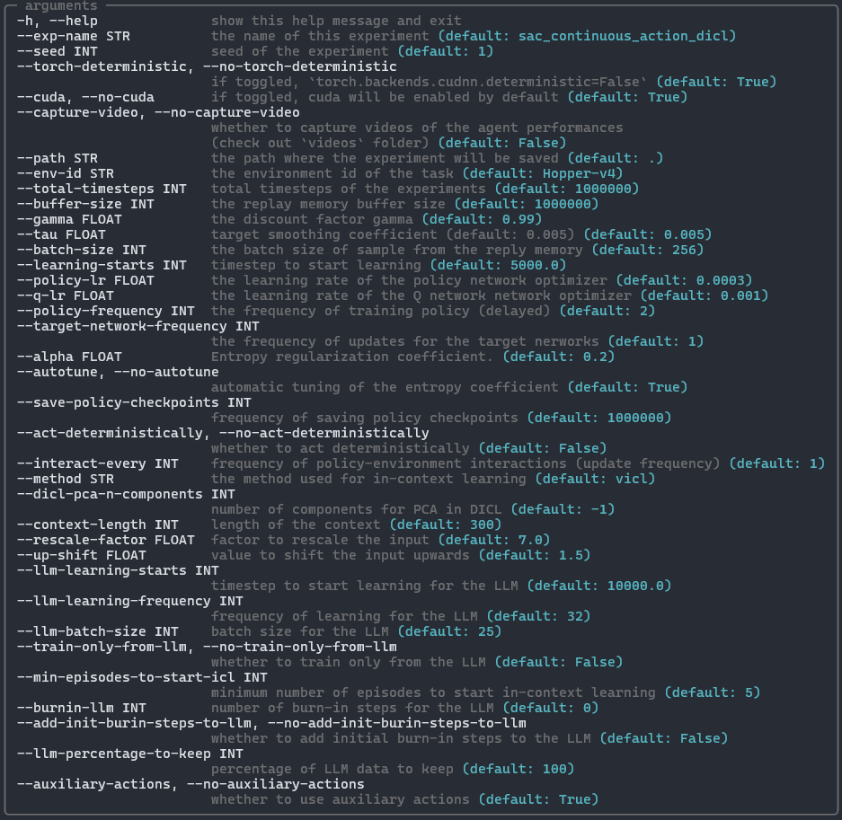
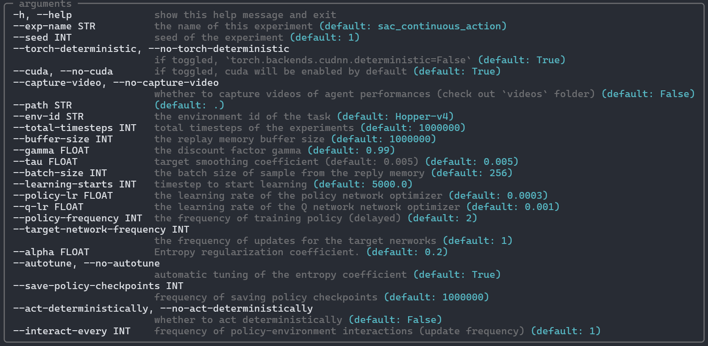

# DICL: Disentangled In-Context Learning

## Overview
This repository contains the official implementation of the paper:

   >Abdelhakim Benechehab, Youssef Attia El Hili, Ambroise Odonnat, Oussama Zekri, Albert Thomas, Giuseppe Paolo, Maurizio Filippone, Ievgen Redko, Balázs Kégl.
   [Zero-shot Model-based Reinforcement Learning using Large Language Models](https://arxiv.org/abs/2410.11711).

### Abstract:
The emerging zero-shot capabilities of Large Language Models (LLMs) have led to their applications in areas extending well beyond natural language processing tasks.
In reinforcement learning, while LLMs have been extensively used in text-based environments, their integration with continuous state spaces remains understudied.
In this paper, we investigate how pre-trained LLMs can be leveraged to predict in context the dynamics of continuous Markov decision processes.
We identify handling multivariate data and incorporating the control signal as key challenges that limit the potential of LLMs' deployment in this setup and propose Disentangled In-Context Learning (DICL) to address them.
We present proof-of-concept applications in two reinforcement learning settings: model-based policy evaluation and data-augmented off-policy reinforcement learning, supported by theoretical analysis of the proposed methods.
Our experiments further demonstrate that our approach produces well-calibrated uncertainty estimates.


## Installation

- create a conda environment:
```
conda create -n dicl python=3.9
```
- activate the environment:
```
conda activate dicl
```
- to run the [getting started notebook](getting_started.ipynb), install the package
```
pip install .
```
- to run the **DICL-SAC** reinforcement learning algorithm, install the optional dependencies
```
pip install .[rl]
```
- for developers, install the optional dependencies
```
pip install -e .[dev]
pre-commit install
```

## Getting started

### DICL
- Try our multivariate time series forecasting method (DICL) using the [getting started notebook](getting_started.ipynb).

### DICL-SAC
- Install the RL optional dependencies then run the command *dicl-sac*. For instance,
```
dicl-sac --seed $RANDOM --env-id HalfCheetah --total-timesteps 1000000 --exp_name "test_5p_vicl" --batch_size 128 --llm_batch_size 7 --llm_learning_frequency 256 --context_length 500 --interact_every 1000 --learning_starts 5000 --llm_learning_starts 10000 --llm_model 'meta-llama/Llama-3.2-1B' --method 'vicl'

dicl-sac --seed $RANDOM --env-id Hopper --total-timesteps 1000000 --exp_name "test_10p_vicl" --batch_size 128 --llm_batch_size 13 --llm_learning_frequency 256 --context_length 500 --interact_every 1000 --learning_starts 5000 --llm_learning_starts 10000 --llm_model 'meta-llama/Llama-3.2-1B' --method 'vicl'

dicl-sac --seed $RANDOM --env-id Pendulum --total-timesteps 10000 --exp_name "test_5p_dicl-s-pca" --batch_size 64 --llm_batch_size 4 --llm_learning_frequency 16 --context_length 197 --interact_every 200 --learning_starts 1000 --llm_learning_starts 2000 --llm_model 'meta-llama/Llama-3.2-1B' --method 'dicl_s_pca'
```
- Arguments



### SAC (baseline):
- Run the command *sac*.
```
sac --seed $RANDOM --env-id "HalfCheetah" --total-timesteps 1000000 --exp_name "test_baseline" --interact_every 1000 --batch_size 128 --learning_starts 5000
sac --seed $RANDOM --env-id "Hopper" --total-timesteps 1000000 --exp_name "test_baseline" --interact_every 1000 --batch_size 128 --learning_starts 5000
sac --seed $RANDOM --env-id "Pendulum" --total-timesteps 10000 --exp_name "test_baseline" --interact_every 200 --batch_size 64 --learning_starts 1000
```
- Arguments:




## Directory structure
An overview of the repository's structure and contents (inside `/src/dicl/`):

- `main/`: Contains classes for the `ICLTrainer` and `DICL`. Objects of type `ICLTrainer` have methods to update the LLM context with a time series, call the LLM, collect the predicted probability density functions, compute statistics, etc. Objects of type `DICL` have methods to fit the disentangler, predict single-step or multi-step, compute metrics (MSE and KS), and plot the results.
- `rl/`: Contains scripts to run the SAC baseline and **DICL-SAC**.
- `data/`: A sample dataset from the D4RL dataset of the HalfCheetah environment for the [getting started notebook](getting_started.ipynb).
- `utils/`: Helper functions and classes.


## License

This project is licensed under the MIT License. See the [LICENSE](LICENSE) file for more details.

## Open-source Participation

Do not hesitate to contribute to this project by submitting pull requests or issues, we would be happy to receive feedback and integrate your suggestions.

## Credits

- We would like to thank [**CleanRL**](https://github.com/vwxyzjn/cleanrl) for providing the SAC implementations used in this project (also **DICL-SAC** is implemented following `cleanrl` principles).
- We also acknowledge the work done in [LLMs learn governing principles of dynamical systems, revealing an in-context neural scaling law](https://github.com/AntonioLiu97/llmICL), from which we have integrated certain [functions](src/dicl/utils/icl.py) into our implementation.

---
